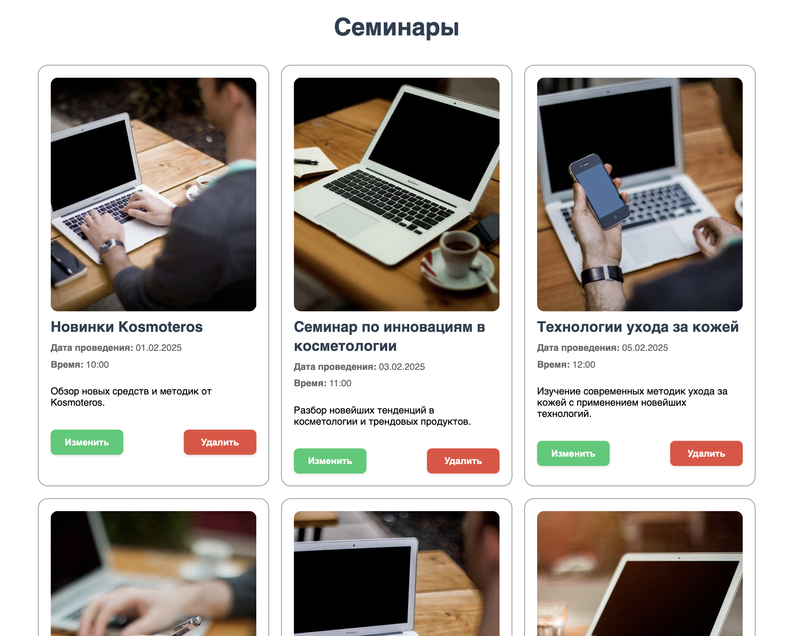

# Тестовое задание

# Приложение для управления семинарами

Это приложение разработано для управления списком семинаров. Приложение предоставляет удобный интерфейс для просмотра, редактирования и удаления информации о семинарах.

## Функциональность

В приложении реализованы следующие возможности:

1. **Отображение списка семинаров**

   - Просмотр всех доступных семинаров в виде карточек
   - Каждая карточка содержит изображение, название, дату, время и описание семинара

2. **Редактирование семинаров**

   - Возможность изменить название семинара
   - Редактирование даты и времени проведения
   - Обновление описания семинара
   - Удобная форма редактирования в модальном окне

3. **Удаление семинаров**

   - Возможность удаления семинара из списка
   - Подтверждение удаления через модальное окно

4. **Адаптивный дизайн**
   - Корректное отображение на устройствах с разными размерами экрана
   - Удобный интерфейс как на десктопе, так и на мобильных устройствах

## Технический стек

- React
- JSON Server для имитации REST API
- CSS для стилизации
- Fetch API для работы с данными

